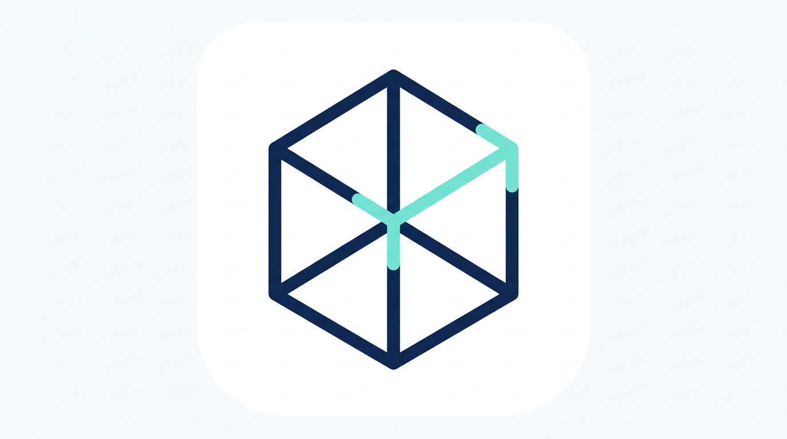
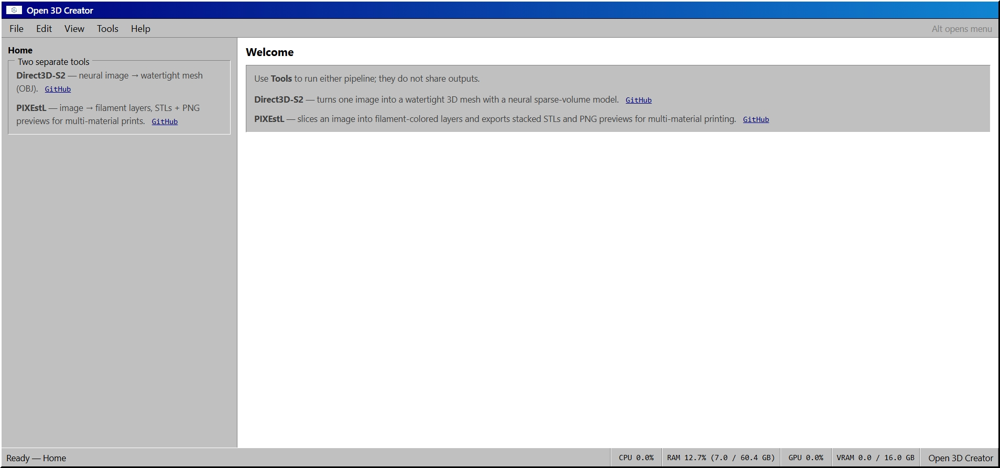
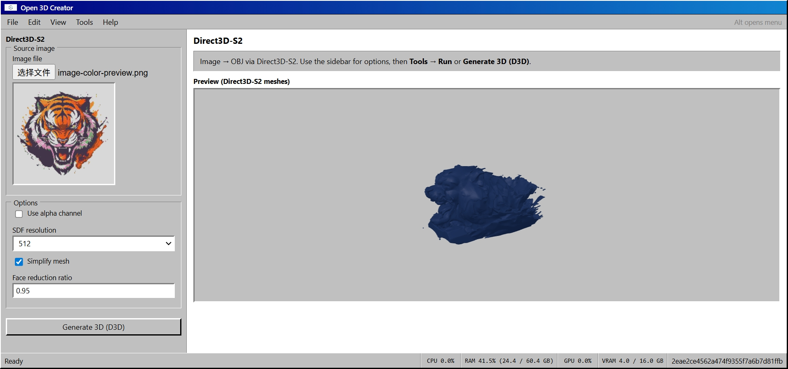
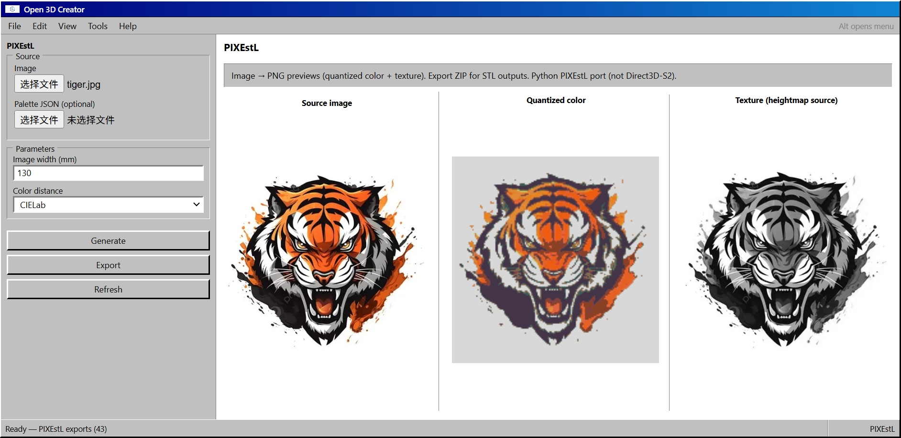

# Open 3D Creator

<p align="center">
  
</p>

Open 3D Creator is a FastAPI app that hosts:

- **[Direct3D-S2](https://github.com/DreamTechAI/Direct3D-S2)** image-to-OBJ generation
- **[PIXEstL](https://github.com/gaugo87/PIXEstL)** image-to-layer preview and ZIP export
- **pcb2print3d** KiCad PCB (`.kicad_pcb`) to STL conversion
- **[Step1X-3D](https://github.com/stepfun-ai/Step1X-3D)** image-to-GLB high-fidelity geometry generation
- a static Windows-style frontend served from `frontend/`

## Features

- Static web UI (no frontend build step required)
- [Direct3D-S2](https://github.com/DreamTechAI/Direct3D-S2) API with lazy model initialization
- [PIXEstL](https://github.com/gaugo87/PIXEstL) API with preview sessions and export ZIP workflow
- pcb2print3d API for KiCad PCB to STL conversion
- Step1X-3D API for image-conditioned GLB generation
- System metrics endpoint for CPU/RAM/GPU/VRAM status
- Legacy Direct3D endpoints retained for compatibility

## Screenshots

UI captures from the static frontend (files in [`images/`](images/)):

### Home



### Direct3D-S2



### PIXEstL



## Project Layout

- `app.py` — app entrypoint (`uvicorn.run("backend.server:app", ...)`)
- `backend/` — FastAPI app, routers, services
- `frontend/` — HTML/CSS/ESM frontend (`frontend/assets/open-3d-creator-logo.png` — app logo)
- `images/` — README screenshots (`home.jpeg`, `direct3d-s2.jpeg`, `pixestl.jpeg`)
- `models/d3d/` — Direct3D-S2 implementation (canonical import: `models.d3d`)
- `models/pcb2print3d/` — KiCad PCB to STL converter implementation
- `models/Step1X-3D/` — upstream Step1X-3D geometry/texture model implementation
- `modules/d3d` — symlink to `models/d3d` for older `modules.d3d` imports (same files; prefer `models.d3d` in new code)
- `outputs/d3d/meshes/` — generated OBJ files
- `outputs/pixestl/sessions/` — PIXEstL preview session files
- `outputs/pixestl/exports/` — PIXEstL ZIP exports
- `outputs/pcb/models/` — generated PCB STL files
- `outputs/step1x3d/models/` — generated Step1X-3D GLB files
- `weights/` — model weights (Direct3D-S2 / related assets)

## Requirements

- Python 3.10+ recommended
- NVIDIA GPU + CUDA recommended for Direct3D-S2
- Model weights available at expected paths (see `backend/server.py`)

Install dependencies:

```bash
pip install -r requirements.txt
```

## Run

```bash
python app.py
```

Defaults:

- host: `0.0.0.0`
- port: `7860`

Open:

- [http://127.0.0.1:7860](http://127.0.0.1:7860)

Optional args:

```bash
python app.py --host 127.0.0.1 --port 7860
```

## API Overview

### Health and Metrics

- `GET /health`
- `GET /api/v1/system/metrics`

### Direct3D-S2 ([GitHub](https://github.com/DreamTechAI/Direct3D-S2)) — `/api/v1/d3d`

- `GET /api/v1/d3d/meshes`
- `GET /api/v1/d3d/meshes/{mesh_id}.obj`
- `POST /api/v1/d3d/mesh/img2obj`
- `DELETE /api/v1/d3d/meshes/{mesh_id}`

### PIXEstL ([GitHub](https://github.com/gaugo87/PIXEstL)) — `/api/v1/pixestl`

- `POST /api/v1/pixestl/generate`
- `GET /api/v1/pixestl/exports`
- `POST /api/v1/pixestl/exports/{export_id}/zip`
- `GET /api/v1/pixestl/exports/{export_id}.zip`
- `GET /api/v1/pixestl/exports/{export_id}/preview/{filename}`
- `DELETE /api/v1/pixestl/exports/{export_id}`

### pcb2print3d — `/api/v1/pcb`

- `POST /api/v1/pcb/convert`
- `GET /api/v1/pcb/models`
- `GET /api/v1/pcb/models/{model_id}.stl`
- `DELETE /api/v1/pcb/models/{model_id}`

### Step1X-3D — `/api/v1/step1x3d`

- `POST /api/v1/step1x3d/generate`
- `GET /api/v1/step1x3d/models`
- `GET /api/v1/step1x3d/models/{model_id}.glb`
- `DELETE /api/v1/step1x3d/models/{model_id}`

### Legacy Direct3D routes (compat)

- `GET /api/v1/meshes`
- `GET /api/v1/meshes/{mesh_id}.obj`
- `POST /api/v1/direct3d_s2/img2obj`
- `DELETE /api/v1/meshes/{mesh_id}`

## Notes

- Frontend is served by FastAPI (`/` and `/static/...`).
- Direct3D-S2 service is initialized lazily on first inference request.
- `requirements.txt` currently reflects a full environment freeze.

## Documentation

- Backend Chinese doc: `docs/backend-zh.md`
- Frontend Chinese doc: `docs/frontend-zh.md`
